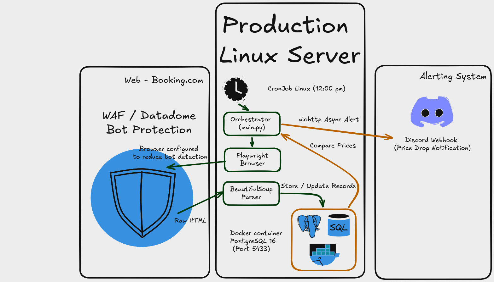
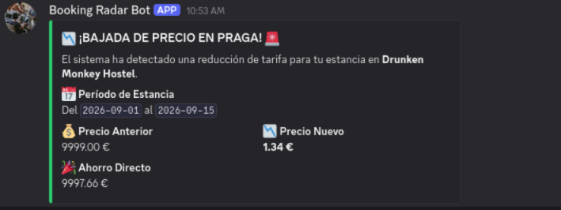
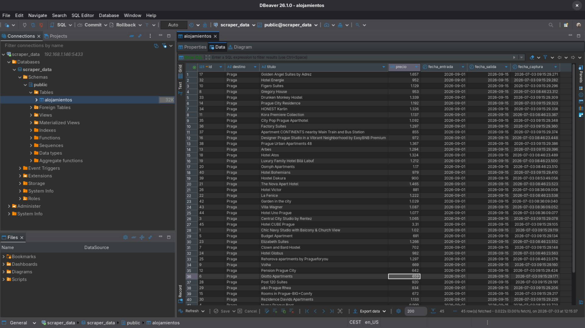

# 🏨 Booking Price Radar

[](https://www.python.org/)
[](https://playwright.dev/python/)
[](https://www.postgresql.org/)
[](https://www.docker.com/)
[](https://discord.com/developers/docs/resources/webhook)

A Python automation project that monitors accommodation prices on Booking.com.

The application scrapes hotel listings for a given destination and date range, stores the results in PostgreSQL and compares them with previous executions. If the price of an existing hotel drops, a Discord notification is automatically sent with the updated price.

The project follows a simple ETL pipeline:

- **Extract** hotel listings with Playwright.
- **Transform** raw HTML into structured data using BeautifulSoup.
- **Load** the results into PostgreSQL.
- Compare prices with previous executions.
- Send asynchronous Discord notifications when a price drop is detected.

---

# 🏗️ Architecture

The project is divided into small modules, each one responsible for a single task.

```text
project/
│
├── scraper/
│   └── engine.py          
│
├── parser/
│   └── extractor.py       
│
├── models.py              
├── notifier.py            
├── main.py                
├── run.sh
└── docker-compose.yml
```



---

# 📸 Example Results

## Discord Notification

Whenever an existing hotel becomes cheaper than in a previous execution, the application automatically sends a Discord webhook notification.



---

## PostgreSQL Persistence

Hotel prices are stored in PostgreSQL and updated on every execution. The application compares each new extraction with the previous stored value to detect price changes.



---

# 🛠️ Tech Stack

- Python
- Playwright
- BeautifulSoup
- SQLAlchemy
- PostgreSQL
- Docker
- aiohttp
- asyncio

---

# 🚀 Quick Start

## 1. Start Infrastructure & Environment

Start PostgreSQL and activate the virtual environment.

```bash
docker compose up -d
source .venv/bin/activate
```

## 2. Configure the target

Open `run.sh` and edit the destination and travel dates.

```bash
CITY="Prague"
CHECKIN="2026-09-01"
CHECKOUT="2026-09-15"
```

## 3. Run the scraper

```bash
./run.sh
```

---

# ⚙️ How It Works

1. Playwright launches a headless Chromium browser.
2. The HTML is downloaded after the page finishes loading.
3. BeautifulSoup extracts hotel names and prices.
4. SQLAlchemy stores the data in PostgreSQL.
5. Existing records are updated with the latest prices.
6. If a hotel becomes cheaper than before, a Discord notification is sent asynchronously.

---

# 📌 Features

- Modular project structure
- Asynchronous scraping with Playwright
- HTML parsing with BeautifulSoup
- PostgreSQL persistence
- SQLAlchemy ORM
- Dockerized database
- Discord webhook notifications
- Configurable destination and travel dates
- Automatic price comparison between executions